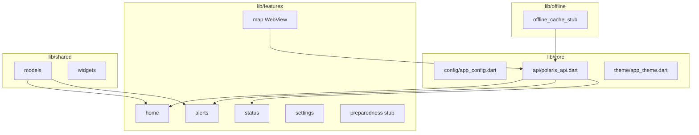

# horizon-mobile

**Evidence:** IMPLEMENTED (testable skeleton + debug APK in CI; **not** app-store ready)

Horizon Mobile — Flutter field shell (ADR-0003). Clean architecture folders with stub screens and real navigation.

## Architecture



## Navigation

**go_router** with `StatefulShellRoute` + bottom `NavigationBar`:

| Route | Screen |
|-------|--------|
| `/` | Home — health + hazard summary |
| `/map` | Map — WebView → `/horizon/` on API |
| `/alerts` | DRAFT alerts list |
| `/status` | Site status — health + `GET /v1/mobile/bootstrap` |
| `/settings` | API base URL (default emulator `http://10.0.2.2:8000`) |
| `/preparedness` | Stub checklist (FAB from shell) |

See [horizon-mobile-test-guide.md](../../docs/manuals/horizon-mobile-test-guide.md).

## API surface

Same POLARIS API as Horizon Web:

- `GET /health`
- `GET /v1/assessments`
- `GET /v1/alerts`
- `GET /v1/mobile/bootstrap` (Horizon path + fixtures)

Map via **WebView** → `/horizon/` (SIMULATED / HISTORICAL_REPLAY only).

## Offline

`lib/offline/` — cache policy documented in [lib/offline/README.md](lib/offline/README.md).

## Local dev

```bash
cd apps/horizon-mobile
flutter pub get
flutter test
flutter run   # Android emulator → 10.0.2.2:8000
```

Physical device:

```bash
flutter run --dart-define=POLARIS_API_BASE=http://192.168.1.10:8000
```

## Disclaimer

Decision-support only. SIMULATED / HISTORICAL_REPLAY data. Human-in-the-loop for DRAFT alerts.
