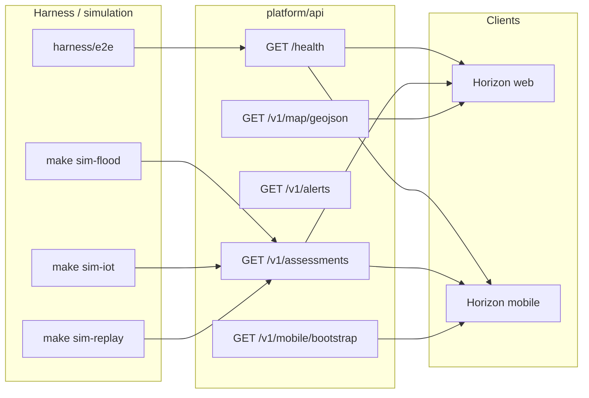

# Mobile data flow (simulation → API → apps)

**Evidence:** DESIGNED (hooks + documented chain; no fake LIVE feed)

POLARIS mobile (`apps/horizon-mobile`) and Horizon web consume the **same** FastAPI surface. Simulations and harness runners populate fixtures and optional PostGIS snapshots; apps never invent operational data.

## Chain

## Phase 2 (not faked today)

- **Live national adapters** feed the API only when `LIVE_INTEGRATED` is implemented per source catalog — mobile shows **SIMULATED** / **LIVE** badges from `data_class`, never assumed LIVE.
- **Push notifications** for DRAFT alerts remain human-in-the-loop; no auto-send.
- **Offline GIS tiles** under `apps/horizon-mobile/lib/offline/` — manifest contract only; persistence NOT IMPLEMENTED in CI.

## Bootstrap hook

`GET /v1/mobile/bootstrap` returns maturity, default fixture ids, and a relative Horizon path for WebView — convenience for local emulators, not a separate product API.

## Related

- [horizon-mobile-test-guide.md](../manuals/horizon-mobile-test-guide.md)
- [local-deployment.md](../manuals/local-deployment.md)
- `apps/forge-studio/` — runner cards (simulations feed web/mobile in phase 2)
